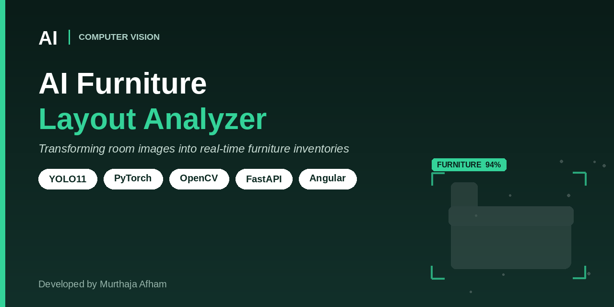
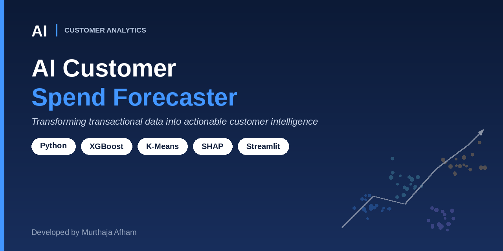
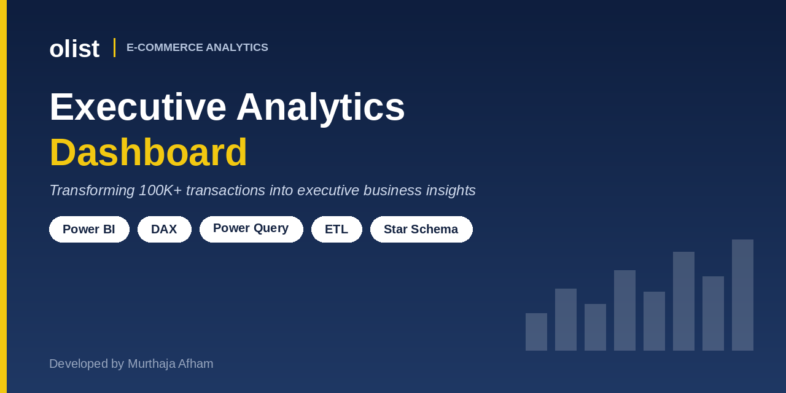

 

  
  

---

### About

- 🎓 **MSc Statistics** — Pondicherry Central University
- 🏢 **Former AI Systems Engineering Intern** @ Zecser Business LLP — contributed to Python backend development, AI workflow automation, and microservice-based recruitment systems.
- 🧠 Passionate about combining statistical foundations with modern AI and machine learning to build reliable and explainable intelligent systems.

### Open to Opportunities

**`AI Developer`** &nbsp;·&nbsp; **`Data Scientist`** &nbsp;·&nbsp; **`Machine Learning Engineer`** &nbsp;·&nbsp; **`Computer Vision Engineer`**

---

### Flagship Projects

<table bordercolor="#30363d">
<tr>
<td width="33%" valign="top">

  
<b>AI Furniture Layout Analyzer</b> 
Real-time computer vision detecting 5 furniture classes — 54% mAP50 via fine-tuned YOLO11n, served through FastAPI + Angular.
</td>
<td width="33%" valign="top">

  
<b>AI Customer Spend Forecaster</b> 
K-Means segmentation + XGBoost forecasting (4.5% test MAE) on 1.29M transactions, deployed via Streamlit with SHAP explainability.
</td>
<td width="33%" valign="top">

  
<b>Olist Executive BI Dashboard</b> 
Power BI Star Schema across 9 tables analyzing 100K+ marketplace transactions — surfaced a critical 3.1% customer retention gap.
</td>
</tr>
</table>

---

### Tech Stack

**Languages & Databases**  
   

**Machine Learning & Deep Learning**  
     

**Data Visualization & BI**  
 

**Backend & Deployment**  
   

---

📫 Reach me at **murthajaafham@gmail.com** or on **[LinkedIn](https://www.linkedin.com/in/murthaja-afham/)**

